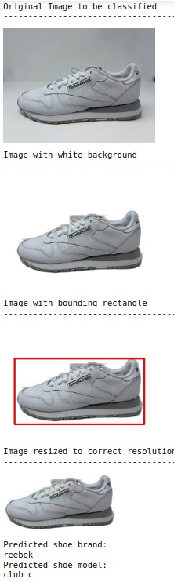

# Shoe Model Classifier using a Convoluted Neural Network
The purpose of the project is to classify 45 different shoe models from images of their side profiles using a CNN. With the model we created you can test the classification with a shoe of any size resolution 190x100 or above with any background. To get optimal performance background should not interrupt the shoe too much and should have a flat side profile.

## Project Structure
- shoe_image_collector.py
  - This script goes through kickscrew.com to obtain side profile images of shoes and saves the image links to a csv
- csv_image_donwnloader.py
  - This script goes through the csv and downloads the images from all the links that were found and puts them in appropriate directory structure
- shoe_image_resizer.py
  - This script uses a bounding rectangle to crop an image to just the shoe subject, it then resizes the image with padding instead of stretching to the 190x100 resolution we trained our CNN model on
- image_preprocess.py
 - Preprocesses the collection of images to add transformations such as brighten, dim, flip, and grayscale
- shoeCNN.ipynb
 - This notebook contains the model architecture and the training/validation of the model. At the bottom of the notebook is also a section for live testing
- livetest_shoeCNN.ipynb
 - This notebook contains just the livetesting portion of the previous notebook

## Dependencies
- torch>=2.1.2
- torchvision>=0.16.2
- numpy>=1.24.2
- Pillow (PIL)>=9.0.1
- rembg>=2.0.53
- cv2 (OpenCV)>=4.7.0.68
- requests>=2.25.1
- pandas>=1.5.3
- selenium>=3.141.0
- webdriver_manager>=4.0.1

## How to test the shoe CNN model
- To test the model use livetest_shoeCNN.ipynb, and on the last cell change the first line to the path to the image you want to test on. Included in the repo are some test images in the testimages folder. If using a new image for optimal accuracy the shoe should be flat and a side profile with only one shoe in the foreground.

Example output:

## Accuracy of model
- The accuracy of the model for the brand is 93% and the specific shoe model is 76%. The reason we separated the brand and shoe model is because for some of the brands with models that had smaller sample size it can start to predict other models of the same brand. Some of the models also were extremely similar to one another within a brand. These issues would be addressed by obtaining more data of these shoe models to reduce class imbalance and provide more variance to train on, but as is we are satisfied with the brand accuracy.
